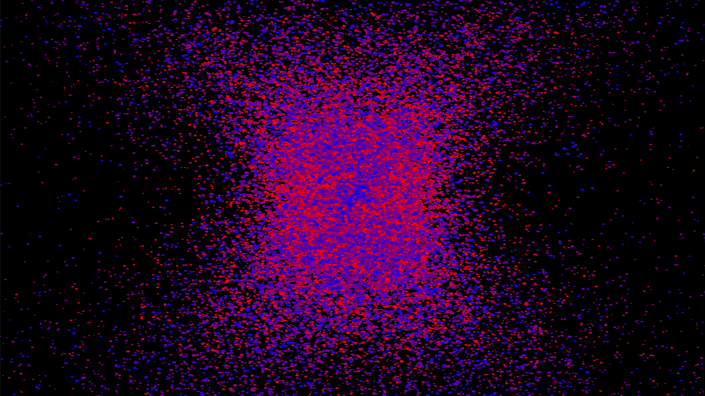

# Cviator
This is just a personal project where I'm making a modular rendering app that I hope to eventuall turn into a library. This
is written in C, mostly to enforce date oriented design for myself, but also because that makes it easier to make
language bindings.

## Building and running
Provided you have the dependencies: OpenGL 4.6 (or later), GLEW (static), SDL2
You should be able to run the following commands:

```
mkdir build
cd build
cmake .. -G "Unix Makefiles"
make
cp ../src/assets ./
./cviator
```

This probably won't build very easily on windows. The cmake uses the find_package feature which,
in my experience has never worked well on windows, but that's possibly just me not understanding
windows very well.

## Gravity Simulator

The above screen shot is from the gravity simulation that will currently run when you execute
the created binary (provided it has access to the assets folder in the right path). This is
really just a tech demo to test/demonstrate the code in its current state.

## Software Architecture
Essentially this is setup as a bunch of header files and then a single C file. This is mostly
to improve compile times. I've written other projects where there are a large number of source files
and got tired of how that can blow out compile times.

I would like to have some sort of notion about state that is an implementation detail in a specific
header, and can't be access from outside of that header. Kind of like private members in modules or
classes for other languages. I can do this with static variables if I start using source files or I
can forward declare a struct for each header in `state.h` and then define the struct in each header.
I intend to go with the latter.
